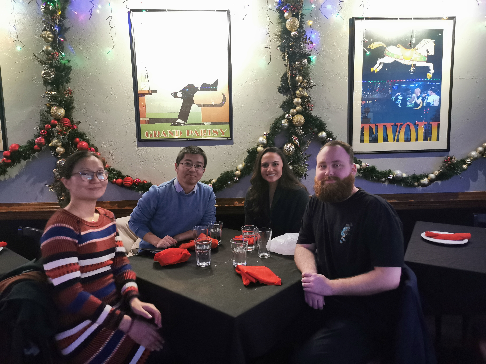
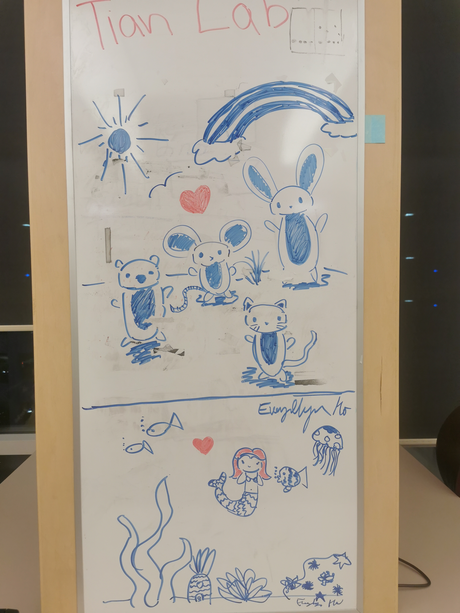
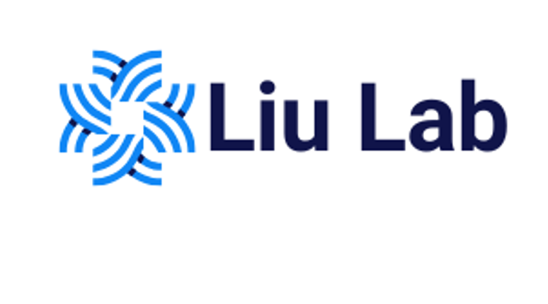
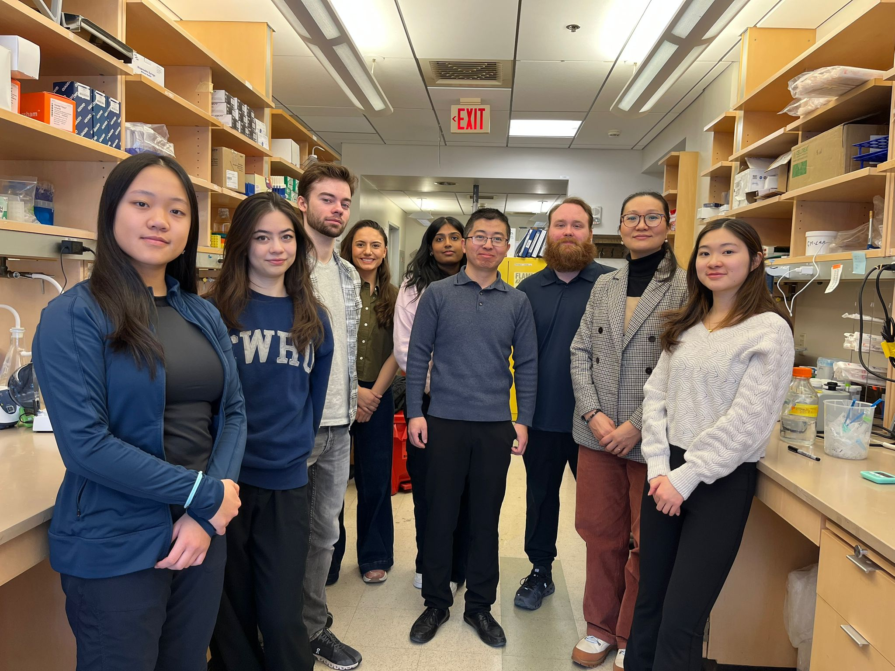
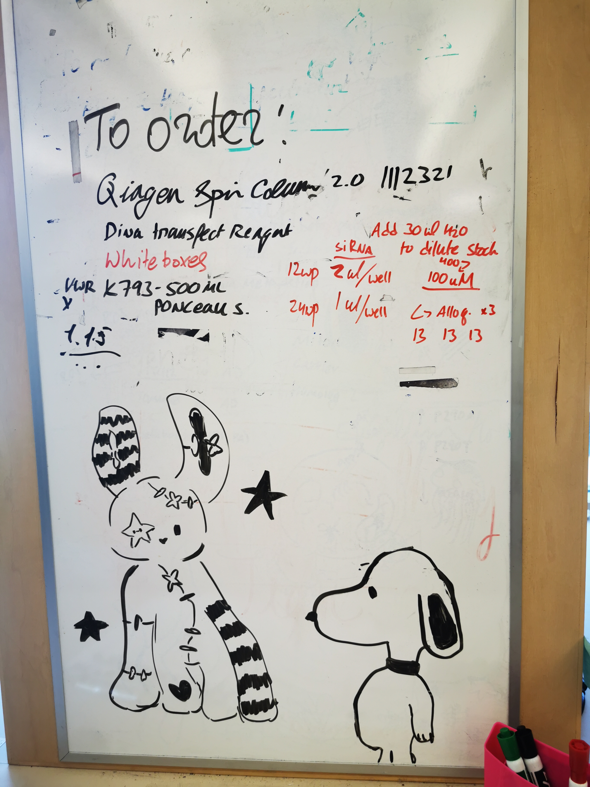
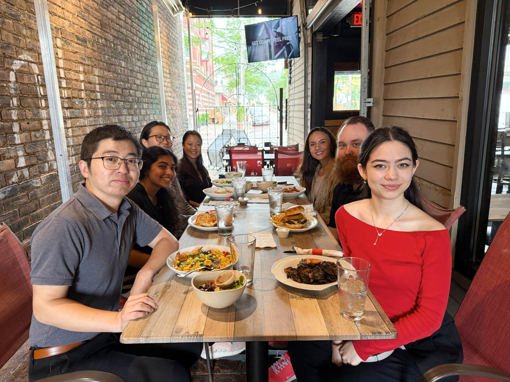
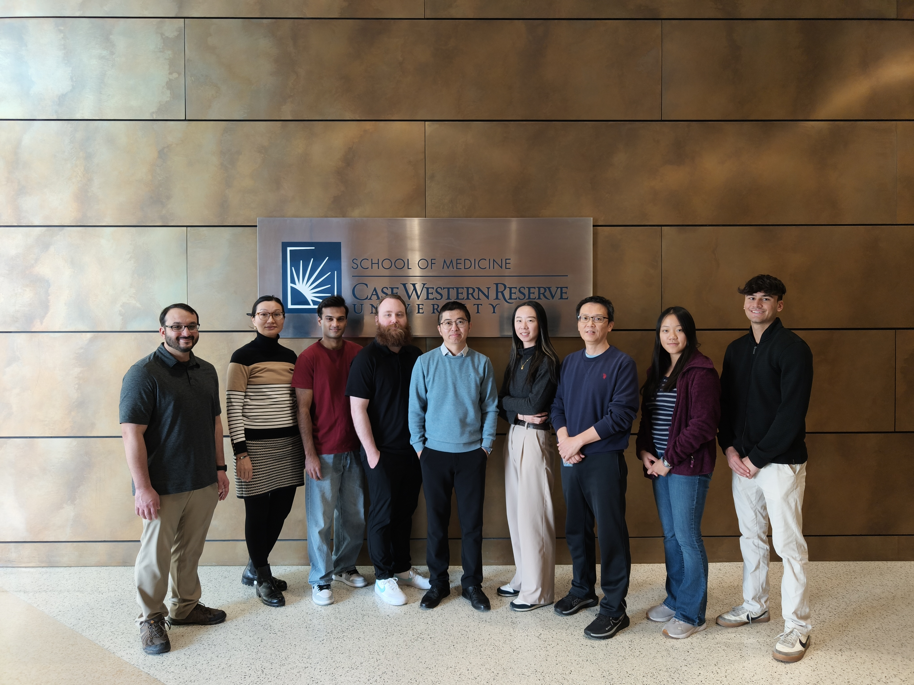
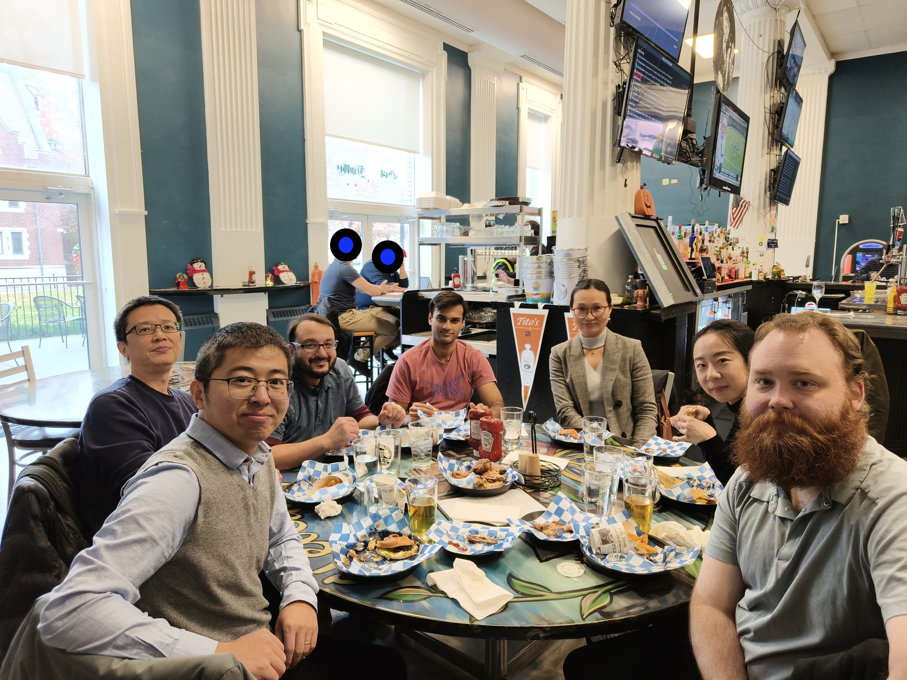
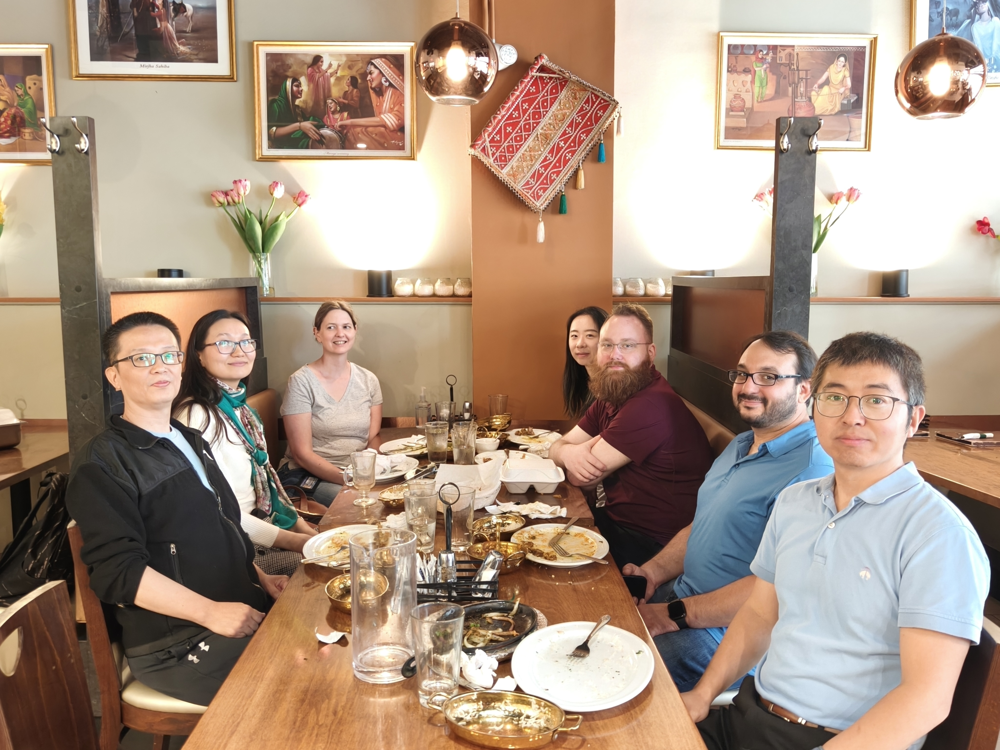

## Lunch Gathering for 2024 Thanksgiving (Nov 27, 2024)

{width="2000"}

While we are celebrating Thanksgiving, those undergraduates are running away... :(

## November 2024, The Artwork from Evangelyn! Good Job!

{width="2000"}

Who is next?

## Credit to Liam for the Liu Lab Logo (Jan 11, 2025)

The Liu Lab logo has been created by Liam Wetzel. He will give the scientific meaning and make it become the scientific fact :)

{width="700"}

Good Job, Liam!

## Lab Photo ( Jan 23, 2025)

It's nice to have our first lab photo. Those who aren't in the picture should make it next time.

## March 2025, The Artwork from Julia, Liam, and Evangelyn!

.jpg)

## June 2025 – Teresa’s Farewell Lunch!

It is bittersweet to share that Teresa will be leaving our lab to begin her medical school journey. While we are sad to see her go, we are incredibly proud and excited for her as she takes this important step toward achieving her dream of becoming a physician.

Since joining us as a Research Assistant II in October 2024, Teresa has made remarkable contributions to the lab. In a short time, she successfully completed a research project and is now preparing to submit her first-author manuscript—an impressive milestone that speaks to her dedication and talent.

We wish Teresa all the very best in medical school and beyond. Please visit us whenever you can—you will always be part of our lab family. We will miss you!

## Lab Photo! (Nov 14, 2025)

## Lunch Gathering for 2025 Thanksgiving (Nov 18, 2025)

## 

## 

## Lunch Gathering for paper publication in *Advanced Science* (June, 2026)

