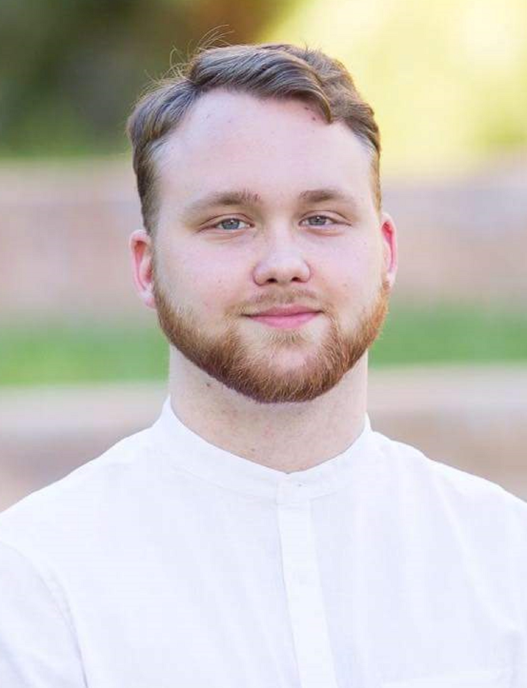
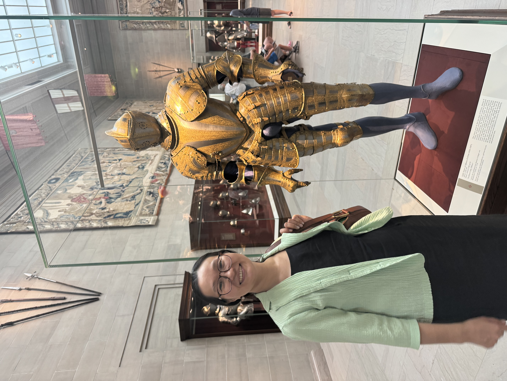
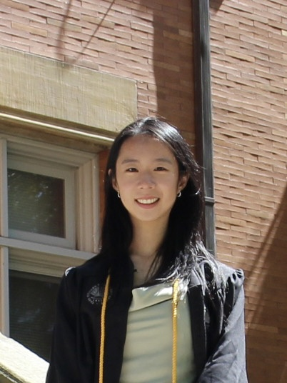
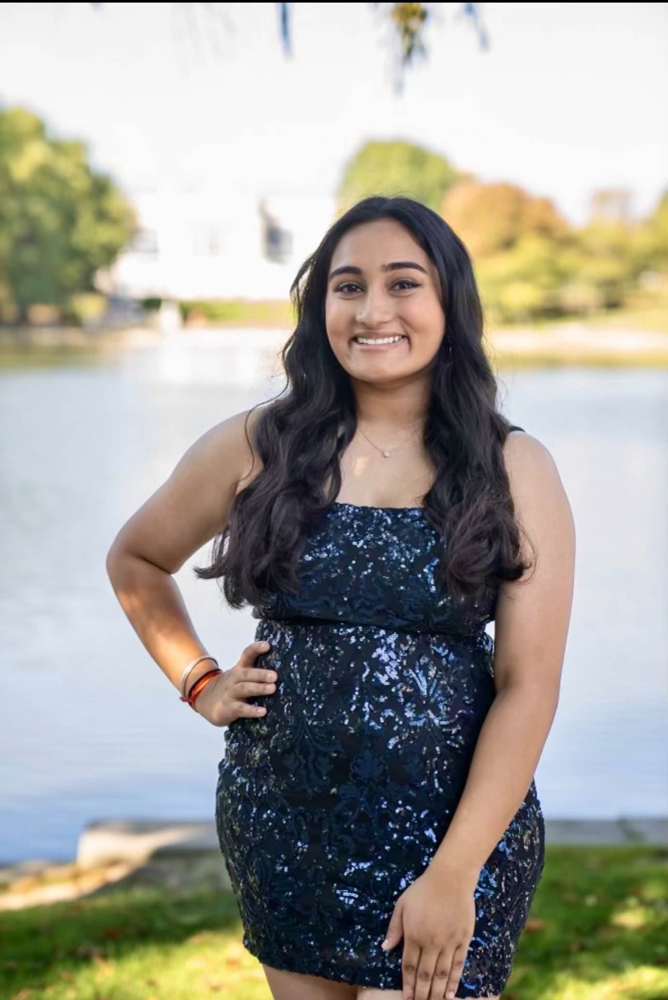
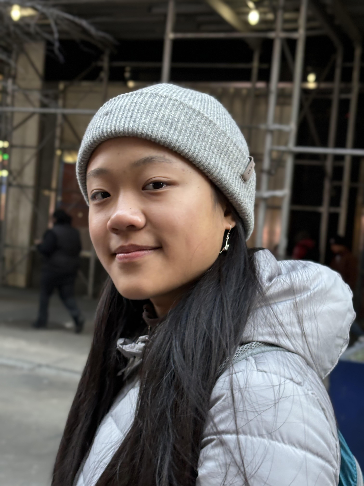
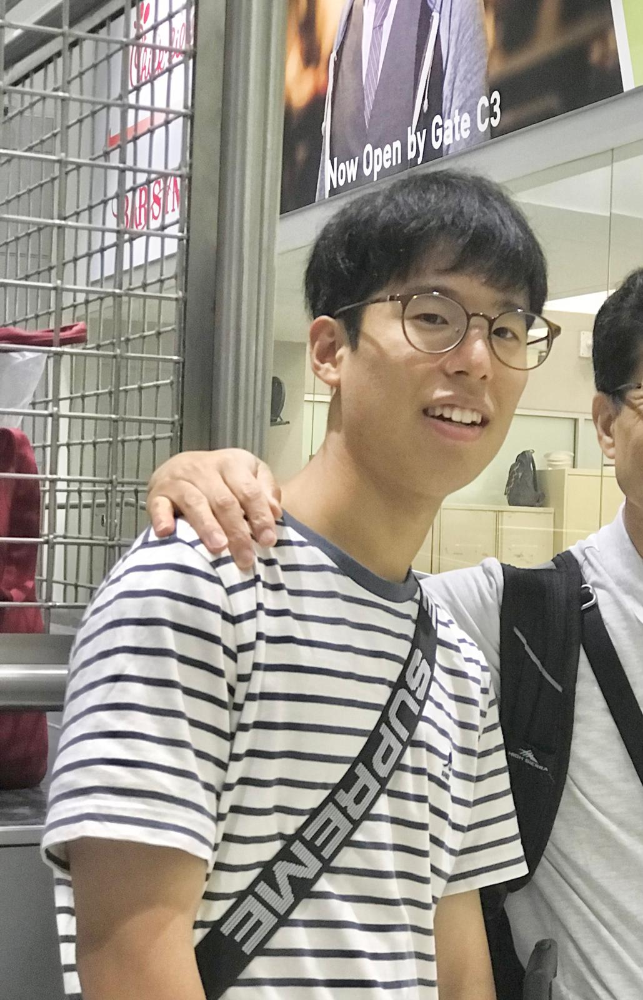
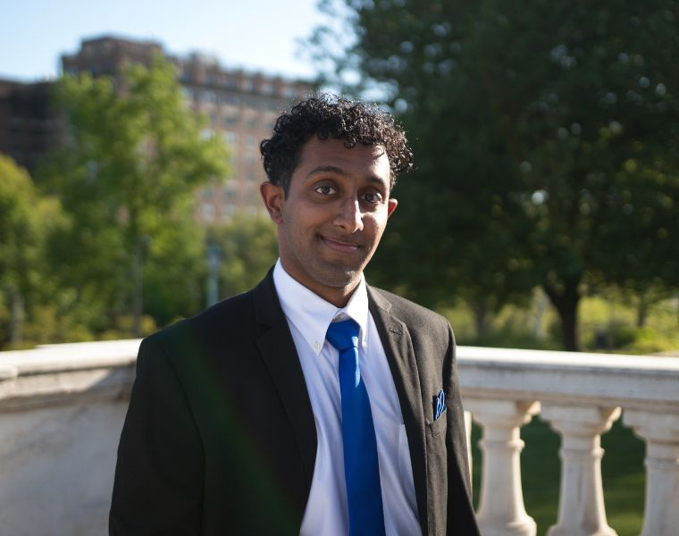
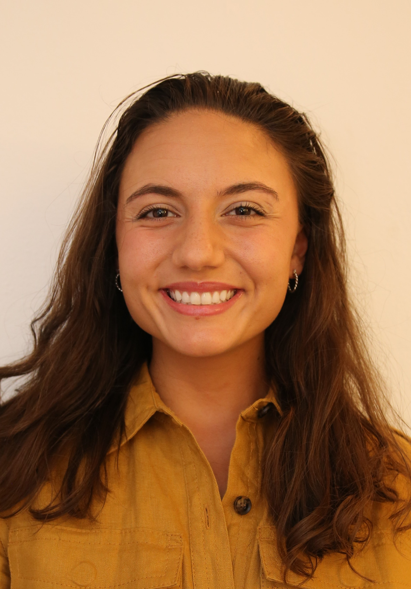

### 

{fig-align="left" width="200"}

### Tian Liu. PhD

Assistant Professor, Department of Pathology

📧 txl757\@case.edu

Tian became a faculty member at CWRU in 2021. He has a long-standing interest in the development of mitochondria-based therapeutic approaches to treat AD and ADRD, as well as the investigation of the role of mitochondria in the progression of neurodegenerative diseases. The modest family that Tian establishes in the small city of Solon, Ohio, consists of his wife, son, and daughter. As a college student, Tian has been a fan of Warcraft 3: The Frozen Throne. Despite the game's decline in popularity, he still plays it on occasion, typically twice a month. Additionally, Tian derives pleasure from spending time with his family with the intention to maintain a cohesive work-life balance.

------------------------------------------------------------------------

{fig-align="left" width="200"}

#### Liam Wetzel, MS

PhD Student, Department of Pathology

📧 lsw59\@case.edu

Liam earned a double major in Biology and Psychology, as well as concentrations in chemistry and neuroscience, from the University of Nevada, Las Vegas in 2019. He has been in the position of research assistant in the laboratory at CWRU in 2022 as part of his master's degree in pathology and joined the CWRU BSTP PhD program in 2025 July.

------------------------------------------------------------------------

{width="200"}

#### William Samsa, PhD

Research Associate , Department of Pathology

William received his PhD in Molecular Biology in 2015. He joined the Liu lab as a Research Associate in the summer of 2025 with an interest in investigating mitochondrial proteins in Alzheimer's Disease and neurodegeneration. In his spare time, he enjoys spending time with his wife and 2 children, golfing, cooking, reading and relaxing.

------------------------------------------------------------------------

{width="200"}

#### **Dina Bugybayeva, MSc**

Research Assistant 1, Department of Pathology

Dina holds a master’s degree from the University of Edinburgh, where her neuroimmunology research focused on the impact of *Trem2* on myeloid cells. Her interest in cellular biology, combined with a passion for travel, has shaped a career filled with diverse and global experiences.

From studying brucellosis at a military-protected compound in Kazakhstan to earning her master’s degree in Scotland and now continuing her journey in Ohio, Dina’s path has been anything but ordinary. In Ohio, she has applied her education to immunology and virology, contributing to several publications before joining CWRU.

At CWRU, Dina draws upon her diverse background to focus on the intersection of mitochondrial biology and neurodegenerative diseases. She appreciates that the Ohio climate resembles that of her hometown, Almaty – a city famously known as the origin of the modern domesticated apple (*Malus sieversii*).

In her free time, Dina enjoys savoring Ohio’s locally grown apple varieties, reading in any of her three languages (Kazakh, Russian, or English), hunting for antiques, cooking, and relaxing with her two black kitties.

#### {width="200"}

#### Ching-Yao Yang, MS

Research Assistant 2, Department of Pathology

Ching-Yao Yang is a Research Assistant in the Department of Pathology at Case Western Reserve University. He earned a Master’s degree in Bioinformatics from the Morsani College of Medicine at the University of South Florida and has experience in both wet lab and computational biology. Outside of work, he enjoys exploring new places with his family.

#### {width="200"}

#### Kexin Zhang, MS

Research Assistant 1, Department of Pathology

Kexin earned a master’s degree in Biology and a bachelor’s degree with double majors in Biomedical Engineering and Psychology. She is interested in neuroscience, particularly how disease states affect cognitive, behavioral, and motor functions. As a research assistant in the Liu lab, she is eager to investigate the mechanisms and potential treatments of neurodegenerative diseases using both in vitro and in vivo models.

{width="200"} 

**Medha Bhimaraju**\
📧 msb238\@case.edu 

Undergraduate Research Assistant, Neuroscience & Religious Studies 

Medha is currently a third year Neuroscience and Religious Studies major at CWRU who is planning on pursuing a Masters next year in Bioethics and Medical Humanities. Medha plans to attend medical school in the future and joined the lab as an undergraduate research assistant in 2024. Outside of the lab, Medha is involved in extracurriculars such as Case Kismat and #MeTooCWRU.

{width="200"}

**Anshul Dash**

Undergraduate Research Assistant, Biomedical Engineering

📧 axd815\@case.edu Anshul is a current 4th year student at CWRU. He is currently studying biomedical engineering and plans on attending medical school in the future. In his free time, he likes watching sports, playing Mario Kart with friends, and swimming.

{width="200"}

#### Evangelyn Ho

Undergraduate Research Assistant, Biology & Computer Science

Evangelyn is a first year biology student at Case Western Student with plans to attend medical school in the future.

------------------------------------------------------------------------

{width="200"}

**Anlin Wei**

Undergraduate Research Assistant, Neuroscience

Anlin is currently a first year undergraduate at CWRU pursuing a Neuroscience degree with plans to attend medical school. Outside of the lab, she also rows crew and is a member of Partners in Health Engage.

------------------------------------------------------------------------

{width="200" height="200"}

#### **Luke Mosca**

Undergraduate Research Assistant, Classics and Biology

Luke is a second-year student at CWRU double majoring in Biology and Classics. He joined the lab as a research assistant in the spring of 2025. He enjoys playing sports, being in nature, and spending time with friends and family.

## **Former Lab Members**

{width="200"}

#### Paul Lee

📧 pyl9\@case.edu

In 2023, Paul enrolled as an undergraduate student in the Neuroscience department at CWRU. He is currently serving in the military in South Korea. Good Luck, Paul!

------------------------------------------------------------------------

{fig-align="left" width="200"}

#### Zexi Zhu. BA

In 2020, Zexi enrolled as an undergraduate student in the Biochemistry department at CWRU. She began to work in Tian's laboratory in 2021 and is currently pursuing a Master's degree in the Public Health Program in Chronic Disease Epidemiology at Yale University.

------------------------------------------------------------------------

#### **David Roy, BS**

David has been employed in the laboratory since 2022. He is presently in the process of preparing for his application to medical school.

------------------------------------------------------------------------

{fig-align="left" width="200"}

#### Viraj Gorthi. MS

Starting in 2021, Viraj has been working as an undergraduate research assistant in the laboratory. At present, he is studying in the first year of medical school at CWRU.

------------------------------------------------------------------------

{fig-align="left"}

#### Pavan Kumaraguru. BA

Since 2021, Pavan has been working as an undergraduate research assistant in the laboratory. He is now a student in the second year of medical school.

------------------------------------------------------------------------

{width="200"}

#### Teresa Thomas. MS

Since 2024, Teresa has been working as a research assistant in the laboratory. She is now a student in the medical school in the University of Vermont.
