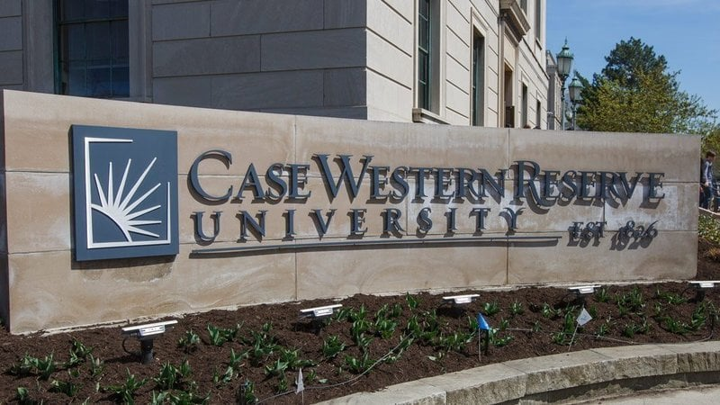
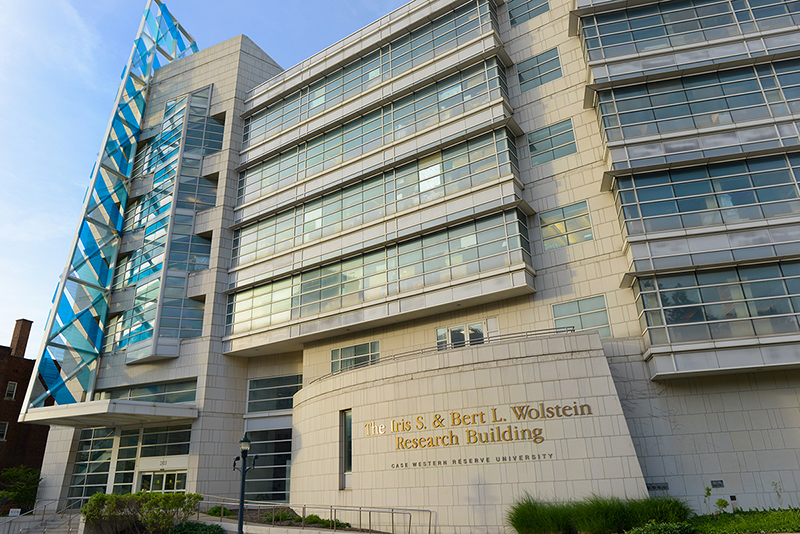

{width="600" height="238"}

## Welcome to Tian Liu's lab {width="50"}at Case Western Reserve University School of Medicine in Cleveland

#### Our lab studies the role of genetic factors and mitochondria-associated mechanisms in neurodegenerative diseases including Alzheimer's Disease (AD), Frontotemporal dementia (FTD), and Amyotrophic lateral sclerosis (ALS). Our goal is to understand mechanistic insights into genetic variants causing the pathogenesis of diseases and to develop translational therapeutic strategies for neurodegenerative disorders.

{width="600" height="300"}
